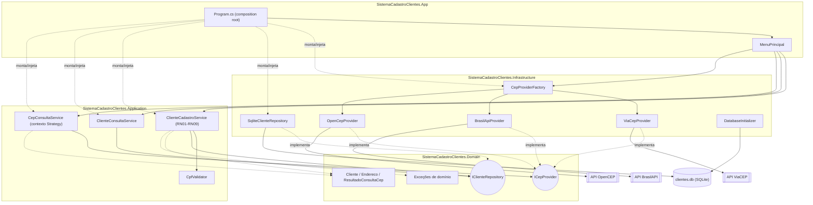

# Diagrama da solução

Componentes principais e como se relacionam. Renderiza nativamente no
GitHub (Mermaid).

## Leitura do diagrama

- **App** só conhece `Application` (regras) e, no `Program.cs`, monta as
  peças concretas de `Infrastructure` — é o único lugar que enxerga o
  sistema inteiro de uma vez (composition root).
- **Application** nunca importa nada de `Infrastructure`: fala só com as
  interfaces `ICepProvider` e `IClienteRepository`, definidas em `Domain`.
- **Infrastructure** implementa essas interfaces (Strategy para os
  provedores de CEP, Repository para a persistência), e é a única camada
  que sabe que existe HTTP ou SQLite por trás.
- As setas tracejadas "implementa" mostram por que adicionar o `OpenCepProvider`
  (Desafio Final) não exigiu tocar em `Domain` nem em `Application`: ele só
  precisou aparecer nesse desenho, ligado a `ICepProvider` e à `Factory`.
